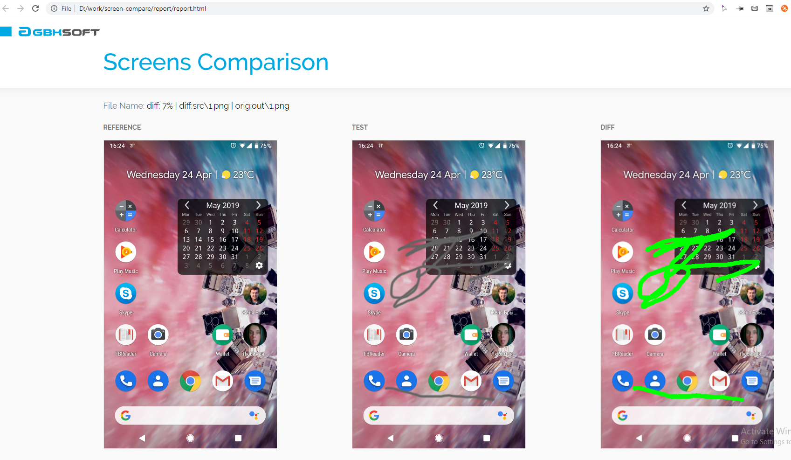

# Images compare tool

This tool allow you to compare two images, calculate percentage of 
difference and view diffs in your browser. Script will not take any 
decisions, its main purpose - only compare 2 images and nothing more, 
you can easily integrate it with your CI/CD and testing tools, based on 
console output. Idea of this tool raised in a moment when other similar 
tools looked like monstrous machinery 

- [x] Image comparison
- [x] Report generation
- [x] Compare two images
- [x] Bulk compare, using config file



# Requirements
- Python 2.7+ (should work with Python 3+ or with minimal modifications)
- PIL 2.8.2+ (Python Pillow)
Script is pretty simple and straightforward, and requirements are very
simple

# Installation
Just clone repository

# Usage
## Compare 2 images

```commandline 
python compare.py /path/to/reference_file path/to/file/to/compare out_file_name
```

* First file is reference image
* Second file will be compared to reference image
* Third filename (only filename) will hold result of difference between 
two images
This command will generate `report.zip` file which will contain all 
files and html report.

## Bulk compare

* Comparing multiple images
* This command will generate `report.zip` file which will contain all 
files and html report.

```commandline 
python compare.py -c path/to/config.file
```

`config.file`
Consist of `;` separated files same as in comparing 2 images
```commandline 
/tmp/source/1.png;/tmp/compare/1.png;res1.png
/tmp/source/2.png;/tmp/compare/2.png;res2.png
```

# Compare report
After comparing images script generates `report.zip` archive, which will
 contain all needed files (sources, compare and result files) along with 
 html file to view report in browser and `report.json`
 
# Changelog
### 3 May 2019
* Initial release
### 16 May 2019
* New report file, now it will look much prettier

# Let us know
We'd be very happy if you sent links to your projects where you use our component. Just send us email to [github@gbksoft.com](mailto:github@gbksoft.com)